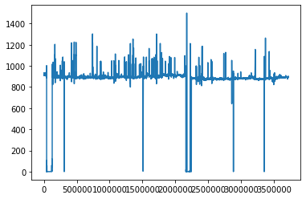

# GAS VENTAS

> Este es un proyecto empleado para la exploración de modelos y relaciones establecidas entre las 102 variables asociadas a un equipo catalogado como crítico dentro de una organización. El archivo suministrado contiene la evolución temporal de cada una de las variables, donde los registros fueron tomados cada 20 minutos para el periodo de tiempo comprendido entre el 01-Ene-2018 hasta el 10-May-2020.

> [**Pueden descargar el archivo .csv de este link**](https://drive.google.com/file/d/1LruXV-BIohTmBBgtYQqmETWbXoPj_edz/view?usp=sharing)


> Procedemos inicialmente a cargar las librerías que serán utilizadas

```python
import pandas as pd
import matplotlib.pyplot as plt
import numpy as np
import seaborn as sns
import seaborn as sb


from statistics import *
from sklearn.model_selection import train_test_split
from sklearn.ensemble import RandomForestRegressor
from sklearn.ensemble import RandomForestClassifier
from sklearn.cluster import KMeans
from sklearn.metrics import pairwise_distances_argmin_min
from sklearn import preprocessing
%matplotlib inline
```

> Seguidamente se realiza el cargue del dataframe (df) proveniente del archivo 'mi_df.csv'

```python
df = pd.read_csv('mi_df.csv', header=0)
```

> Luego una ligera inspección de los datos a ser analizados

```python
df.head()
```

> En total son 103 columnas, cada una representa una variable del equipo siendo que la primera columna corresponde a la estampa de tiempo (Todas las variables tienen la misma estampa de tiempo) y el volumen total de los datos es de 3GB apoximadamente.


```python
df.info()
```

```python
<class 'pandas.core.frame.DataFrame'>
RangeIndex: 3719520 entries, 0 to 3719519
Columns: 103 entries, Unnamed: 0 to GASVENTAS105[, "Value"]
dtypes: float64(101), int64(1), object(1)
memory usage: 2.9+ GB
```

```python
df.describe()
```

> Poner bastante atención a las variables con mayor STD. Adicionalmente es posible elminar la variable GASVENTAS93[, "Value"] dado que no tiene asociado ningún valor y no le aporta nada al análisis.

```python
del(df['GASVENTAS93[, "Value"]'])
```

> Como no se puede visualizar el dataframe en su totalidad, procedemos a usar algunos comandos para verificar la existencia de datos **Null** o **NaN**

```python
df.columns[df.isnull().any()]
```
> El resultado indica las columnas con datos categorizados como  Null o NaN

```python
Index(['GASVENTAS30[, "Value"]'], dtype='object')
```
> Tambien es posible conocer la cantidad de datos que cumplen con la condición de búsqueda

```python
df.isnull().sum().sum()
```

```python
554513
```
> Indicando que existen al menos 554513 registros que deben ser corregidos o eliminados. Adicional a eso tambien es posible ir directamente al valor junto con su respectiva posición mediante el siguiente comando.

```python
null_columns=df.columns[df.isnull().any()]
df[null_columns].isnull().sum()
print(df[df.isnull().any(axis=1)][null_columns].head())
```

```python
   GASVENTAS30[, "Value"]
0                     NaN
1                     NaN
2                     NaN
3                     NaN
4                     NaN
```

> Debido al elevado número de registros conflictivos no es recomendable eliminarlos dado que este procedimiento eliminaría la fila completa, no apenas de esta variables sino de las demás. En ese contexto, existen dos posibilidades:
- Eliminar toda la columna al igual que se hizo con la variable 'GASVENTAS30[, "Value"]'
- Atribuirle el valor de la media de la variable a esos registros conflictivos.

```python
df.columns
```

```python
df = df.rename(columns={'Value':'GASVENTAS1[, "Value"]'})
```

```python
df.head()
```

```python
%matplotlib inline
```

```python
df['GASVENTAS92[, "Value"]'].plot()
```


> Note la irregularidad del comportamiento presentado en la mitad del intervalo y que esa misma irregularidad está presente en las siguientes variables. Determinar con exactitud la fecha y consultar el la vitácora de los operadores si corresponde a alguna maniobra planeada.

```python
df['GASVENTAS95[, "Value"]'].plot()
```



```python
df['GASVENTAS101[, "Value"]'].plot()
```


```python
df['GASVENTAS104[, "Value"]'].plot()
```


```python
df['GASVENTAS13[, "Value"]'].plot()
```


> La variable anterior corresponde a la velocidad de la turbina. Su relevancia es bastante significativa dado que es un buen indicador del funcionamiento de la turbina y en ese sentido puede considerarse que si la variable está por debajo de las 6000 rpm la turbina está en falla, si está en 0 rpm la turbina está fuera de línea, entre 8000 y 9000 la turbina está operando normalmente y por encima de 9000 rpm la turbina está en falla. En ese sentido es posible crear una nueva columna para introducir las condiciones o estados operativos descritos anteriormente.

``` Python
df['Estado_rpm'] = ''
df.loc[df['GASVENTAS13[, "Value"]']==0, 'Estado_rpm'] = 1
df.loc[(df['GASVENTAS13[, "Value"]']>0) & (df['GASVENTAS13[, "Value"]']<6000), 'Estado_rpm'] = 2
df.loc[(df['GASVENTAS13[, "Value"]']>=6000) & (df['GASVENTAS13[, "Value"]']<8000), 'Estado_rpm'] = 3
df.loc[(df['GASVENTAS13[, "Value"]']>=8000) & (df['GASVENTAS13[, "Value"]']<9000), 'Estado_rpm'] = 4
df.loc[df['GASVENTAS13[, "Value"]']>=9000, 'Estado_rpm'] = 5
```

> Comprobamos que a todas las filas les fue atribuido alguno de los estados

```python
df['Estado_rpm'].value_counts()
``` 

```python
4    2543143
3     483779
5     470274
2     222209
1        115
Name: Estado_rpm, dtype: int64
``` 

> En un conjunto de datos de más de 100 variables, muy probablemente menos del 50% realiza un aporte significativo en la sintetización de modelos. Adicional a eso el costo computacional resultaría favorecido. Podemos implementar la desviación estándar para identificar aquellas variables cuyo comportamiento ha sido dinámico y por lo tanto su contribución en la extracción de modelos es mayor.

```Python
metricas = df.describe()
#metricas.info()
#std = metricas.iloc[2,:]
#print(std)
```

> Es posible graficar el vector correspondiente a la desviación estándar para visualizar las variables con comportamientos más dinámicos.

```Python
metricas.iloc[2,1:].plot(kind='bar', figsize=(20,10))
```


> Note que las variables con mayor desviación son GASVENTAS13[, "Value"], GASVENTAS14[, "Value"] y GASVENTAS101[, "Value"], siendo que GASVENTAS13[, "Value"], tal como se mencionó anteriormente corresponde a la velocidad de la turbina y por lo tanto es considerada una de las variables de mayor relevancia.

> Vamos ahora a crear los archivos de entrenamiento y validación, para eso he decidido tomar el 80% de los datos para entrenar y el 20% para validar


```Python
train, test = train_test_split(df, test_size=0.2)
```

> Note que efectivamente se han repartido los datos en las proporciones correspondientes

```Python
print('all:  ', len(df))
print('train:', len(train))
print('test: ', len(test))
```

```Python
all:   3719520
train: 2975616
test:  743904
```
> Finalmente se almacenan los archivos Gasv-train y Gasv-test

```Python
train_file = 'Gasv-train.csv'
pd.DataFrame.from_records(train).to_csv(train_file, index=False, header=True, sep=',')

test_file = 'Gasv-test.csv'
pd.DataFrame.from_records(test).to_csv(test_file, index=False, header=True, sep=',')
```

> Por tratarse de un ejercicio cuya salida corresponde a varios estados, no es posible usar los algoritmos de clasificación binaria
